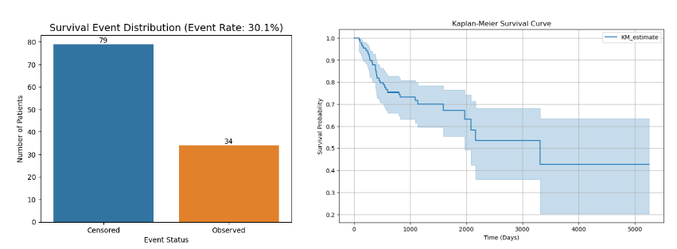
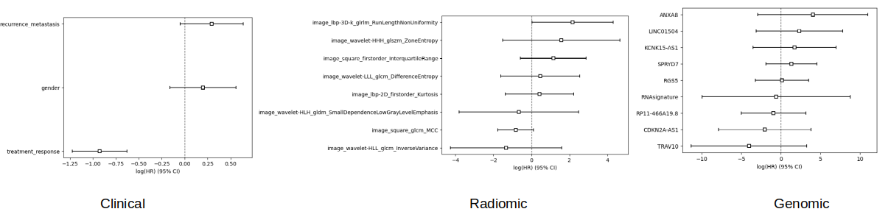
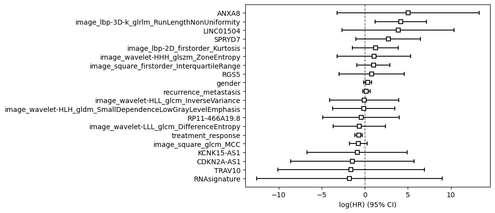

# Radiogenomics Analysis for Head and Neck Cancer Survival Prediction

## Project Overview

Predicting survival in head and neck cancer patients using clinical data, genetic information, and CT scan analysis. Combines multiple data types to build better prognostic models.

## Objectives

- Develop and validate prognostic signatures using clinical, genomic, and radiomic data

## Dataset

For this project, we will be using the followin preprocessed data available at Mendeley data repository.[1]
###### [CT‑based radiogenomics for improving survival prediction in locally advanced head and neck squamous cell carcinoma with neoadjuvant therapy](https://data.mendeley.com/datasets/7gzyzmn54s/1)

- Published: 3 March 2025
- Version 1 | DOI:10.17632/7gzyzmn54s.1
- Contributor: Li Zheng

## Step 1: Exploratory Data Analysis 

During exploratory data analysis, we identified patient ID misalignment across clinical, radiomic, and genomic datasets, with survival times shuffled between patients. By matching survival patterns and event status across modalities, only 115 patients (76% of the cohort) was selected for robust analysis.

## Step 2: Survival Analysis

### 2.1.  Non Parametric Analysis

##### Censoring Information

Event Distribution:
- Overall Event Rate: 30.1% of patients experienced the event (death)
- Censoring Pattern: 69.9% of patients were censored (still alive at last follow-up)

###### Kaplan-Meier Survival Analysis:

- **Very Extended Follow-up**: Study tracks patients up to ~14 years
- **Long-term Plateau**: Survival stabilizes around 40% beyond 8 years
- **Gradual Decline**: Unlike typical cancer curves, decline is more gradual
- **Exceptional Long-term Survivors**: ~40% survival at 11+ years is notable for advanced HNSCC
 

### 2.2. Semi-parametric Analysis (CoxPhFitter) with individual modalities 

#### Clinical Model - **Strongest & Most Reliable**
- **Treatment Response**: HR = 0.40 (p < 0.001)  
  - 60% reduction in mortality risk with better treatment response
  - Most powerful predictor across all modalities
- **Recurrence/Metastasis**: HR = 1.34 (p = 0.093)
  - 34% increased mortality risk trend
- **Gender**: HR = 1.22 (p = 0.282)  
  - Minimal effect on survival
- **Statistical Quality**: Excellent precision, clinically meaningful effects

#### Radiomics Model - **Promising & Interpretable**
- **RunLengthNonUniformity**: HR = 8.77 (p = 0.047)
  - 777% increased mortality risk with heterogeneous tumor texture
  - Only statistically significant radiomics feature
- **Other Features**: Showed directional trends but not significant
- **Key Insight**: CT texture analysis captures prognostic information beyond visual assessment

#### Genomics Model - **Statistically Challenging**
- **ANXA8**: HR = 56.38 (p = 0.256) - Dramatic but unreliable
- **TRAV10**: HR = 0.02 (p = 0.278) - Protective but unstable  
- **All Genes**: Wide confidence intervals indicating overfitting
- **Challenge**: 9 genes with only 45 events led to unstable estimates

#### Key Takeaways

1. **Treatment response is the dominant survival predictor** across all analyses
2. **Radiomics shows clinical potential** with one significant texture feature
3. **Genomics requires larger samples** or regularization for stable estimates
4. **Multi-modal integration** likely needed for optimal prediction

#### Statistical Insights

- **Clinical**: Clean, precise estimates with tight confidence intervals
- **Radiomics**: Reasonable stability with one significant finding  
- **Genomics**: Statistical instability due to high dimensionality and limited events

  
### 2.3. Semi-parametric Analysis (CoxPhFitter) multiomics (all three modalities combined)

| Modality | Feature | Combined Model HR | Individual Model HR | Change | Significance | Key Insight |
|----------|---------|------------------|---------------------|---------|--------------|------------|
| **Clinical** | Treatment Response | 0.48 | 0.40 | Weaker | p = 0.001 | Still significant but effect reduced |
| **Clinical** | Recurrence/Metastasis | 1.21 | 1.34 | Weaker | p = 0.387 | Lost significance in combined model |
| **Radiomics** | RunLengthNonUniformity | 64.57 | 8.77 | **7.4x Stronger** | p = 0.006 | Dominant predictor in combined model |
| **Genomics** | ANXA8 | 152.54 | 56.38 | More Extreme | p = 0.232 | Still unreliable, massive CIs |
| **Genomics** | All Genes | Wide CIs | Wide CIs | No Improvement | All p > 0.15 | Persistent overfitting issues |

## Summary (when 3 modalities combined)
- **Radiomics emerged** as the most powerful modality when features compete
- **Clinical features weakened** as they share predictive power with radiomics  
- **Genomics remained unstable** despite multi-modal integration
- **RunLengthNonUniformity** appears to capture fundamental tumor aggression

## Ethics and Data Use 
**Ethical Considerations**:
- All original data collection was conducted with appropriate ethical approvals by the original researchers [1]
- This analysis uses only de-identified, publicly available data
- This project is for educational purposes only
- No institutional review board (IRB) approval required for secondary analysis of public data

## REFERENCES

[1] Zheng, Li (2025), “CT‑based radiogenomics for improving survival prediction in locally advanced head and neck squamous cell carcinoma with neoadjuvant therapy”, Mendeley Data, V1, doi: 10.17632/7gzyzmn54s.1
